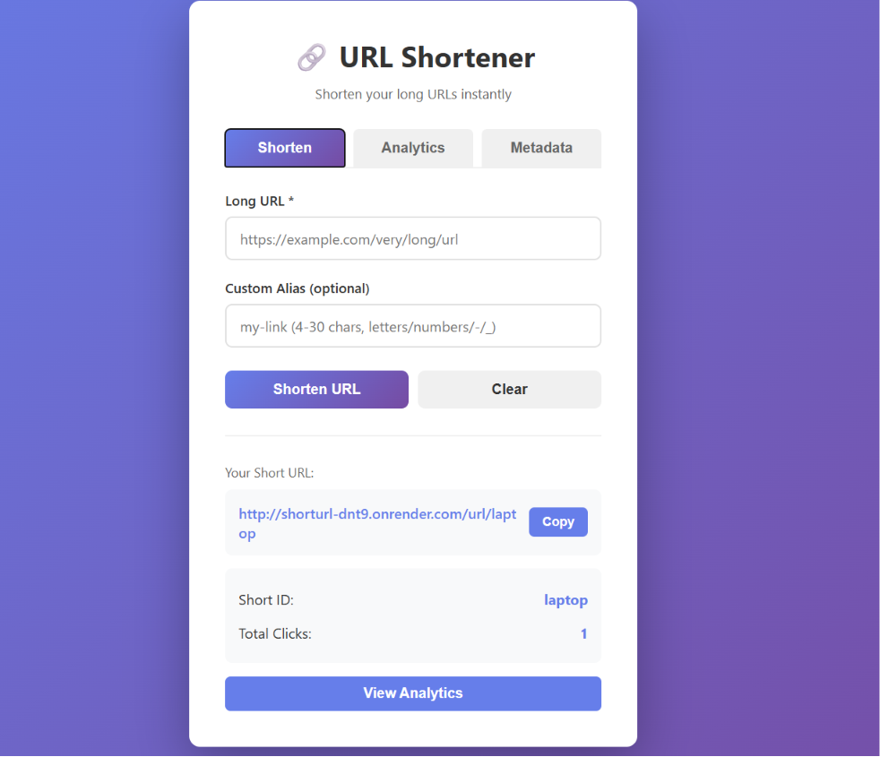
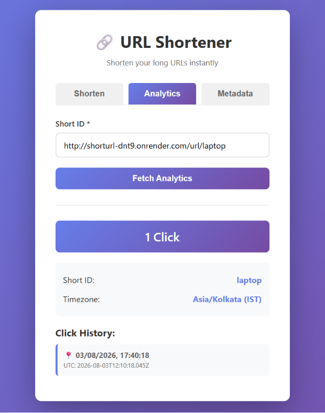
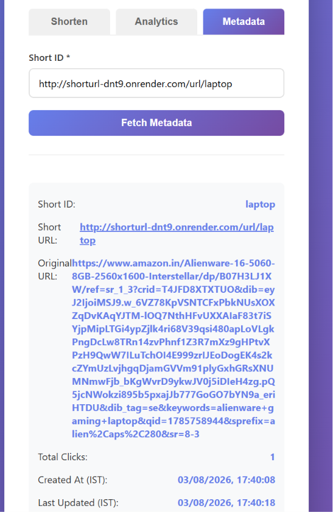

# URL Shortener

A clean REST API for shortening links, tracking visits, and returning lightweight analytics. Built with Node.js, Express, MongoDB, and Mongoose.

## Overview

This project supports short URL generation, optional custom aliases, redirect tracking, and metadata/analytics responses with IST-friendly timestamps.

## Media Preview







<video controls width="100%" src="media/full_process.mp4"></video>

## Key Features

- Create short URLs from long links
- Optional custom alias support with validation and uniqueness checks
- Automatic `https://` normalization when a protocol is missing
- Redirect tracking with visit history
- Analytics endpoint with UTC and IST timestamps
- Metadata endpoint with created/updated timestamps
- Consistent JSON responses for validation and server errors

## Tech Stack

- Node.js and Express
- MongoDB and Mongoose
- shortid for generated aliases
- dotenv for environment configuration

## Setup

1. Install dependencies:

```bash
npm install
```

2. Create a `.env` file in the project root:

```env
MONGO_URI=your_mongodb_connection_string
PORT=8001
```

3. Start the app:

```bash
npm run dev
```

For production:

```bash
npm start
```

The server runs at `http://localhost:8001`.

## API Endpoints

### Create a short URL

`POST /url`

Request body:

```json
{
  "url": "https://example.com/some/long/link",
  "customAlias": "my-link"
}
```

If `customAlias` is omitted, the API generates one automatically. The response returns the short ID and the public short URL.

### Redirect to the original URL

`GET /url/:shortId`

Redirects to the stored destination and records the visit time.

### Get analytics

`GET /url/analytics/:shortId`

Returns total clicks and visit history with both UTC and IST timestamps.

### Get metadata

`GET /url/meta/:shortId`

Returns the stored URL, public short URL, timestamps, and total click count.

## Project Structure

```
controllers/   Business logic
models/        Mongoose schema
routes/        API routes
media/         Screenshots and demo video
connect.js     MongoDB connection helper
index.js       App entry point
```

## Notes

- The app also exposes a `/health` endpoint for deployment checks.
- Static assets in `public/` are served after the API routes.
